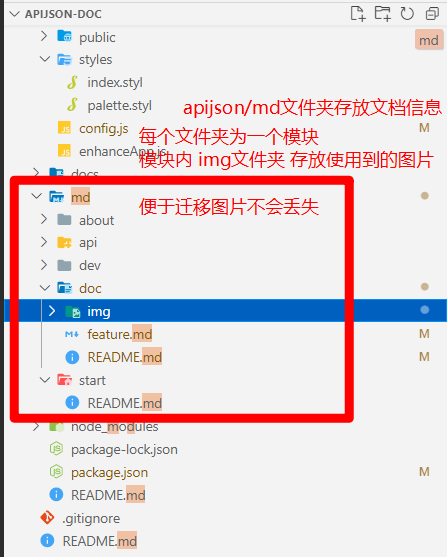
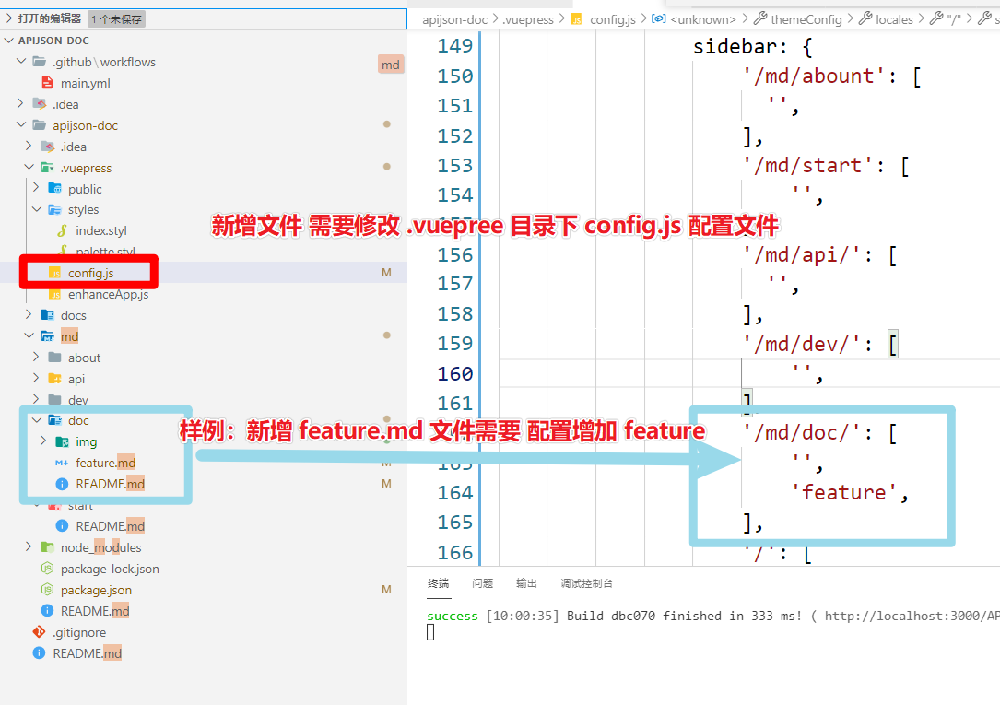

# 文档工程
::: tip
目录
[[toc]]
:::
## 关于文档 - 文档的搭建
- 为什么使用 vuepress？
  [@pdai](https://www.pdai.tech/)已经实现了很好的轮子
  - [搭建Vuepress博客/文档系统：搭建，PDF导出，SEO，自动编译，自动部署，域名，HTTPS，备案等](https://segmentfault.com/a/1190000020971477)
  - [关于文档 - 文档的搭建](https://www.pdai.tech/md/about/blog/blog-build-vuepress.html)
- 使用列表
  - 返回最上插件
    ```
        npm install -D @vuepress/plugin-back-to-top@next
    ``` 
    使用
    ```
        module.exports = {
            plugins: ['@vuepress/back-to-top']
        }
    ```
  - 添加图片缩放插件

## 文件树



## 文档现状
> 就开源领域来说，
>文档以及网站是开源软件的基础以及核心竞争力，</br>
>是使用时非常关注，开发时容易被忽视的领域。</br>
>好的文档设计，可以帮助开发者快速地上手以及解决使用问题。</br>
>国外已经是比较成熟的行业，IBM、微软、Google等都有相关的职位。</br>
>当然国内公司也逐步开始重视起来，菊厂、阿里、腾讯也都开放了相关的职位，并组建了对应的团队。</br>
>同时，文档开发是一个典型的应用的领域，</br>
>圈子里更多把他理解成技术传播、内容建设，文档只是作为其中之一的载体，可以做的事情其实非常多。
>
