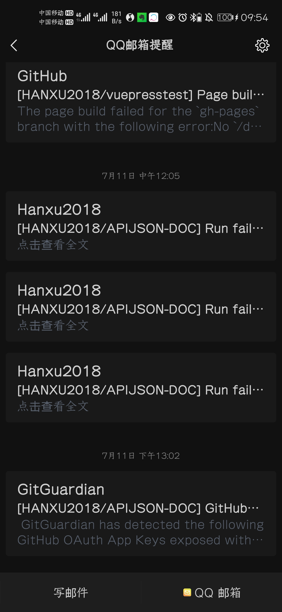
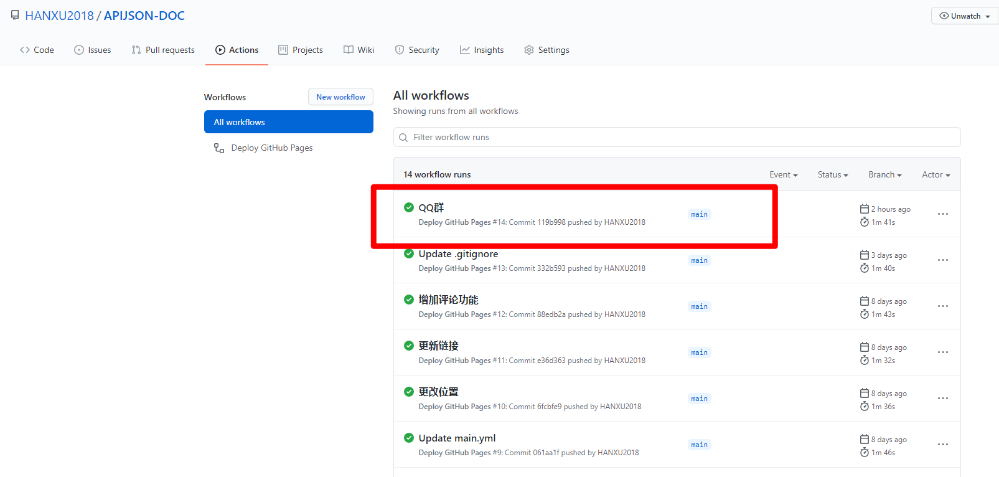
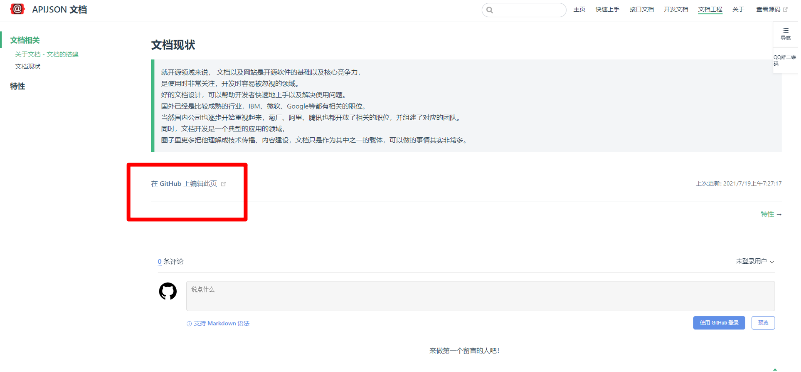
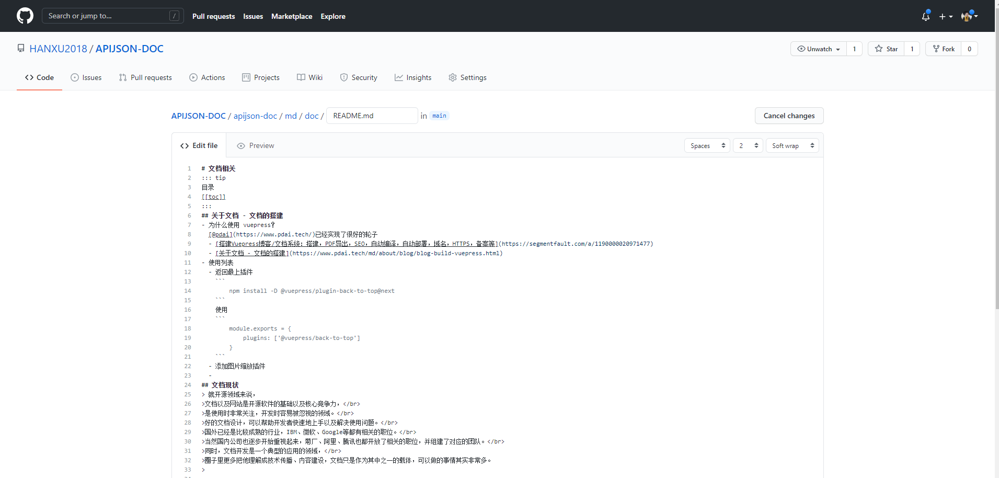
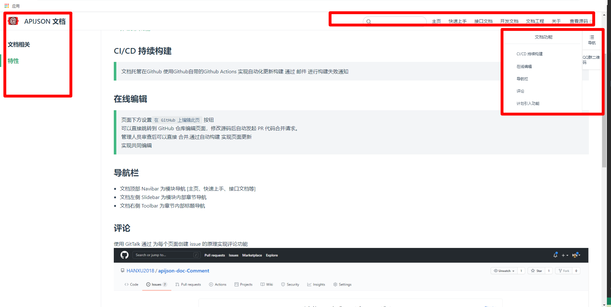
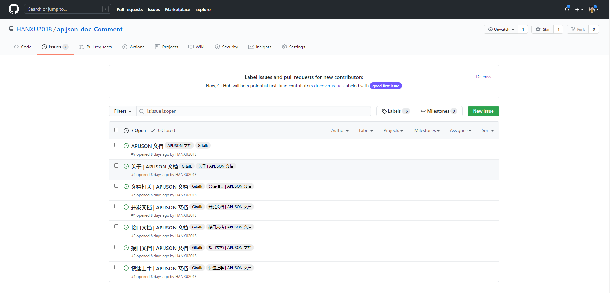

# 文档功能
> 这篇文档 介绍 APIJSON 文档 系统拥有的功能 特性

[[toc]]

## CI/CD 持续构建
> 文档托管在Github 使用Github自带的Github Actions 实现自动化更新构建
> 通过 邮件 进行构建失败通知

```bash
name: Deploy GitHub Pages

# 触发条件：在 push 到 master 分支后
on:
  push:
    branches:
      - main

# 任务
jobs:
  build-and-deploy:
    # 服务器环境：最新版 Ubuntu
    runs-on: ubuntu-latest
    steps:
      # 拉取代码
      - name: Checkout
        uses: actions/checkout@v2
        with:
          persist-credentials: false

      # npm install
      - name: npm install
        run: cd apijson-doc && npm install
      # vuepress
      - name: vuepress
        run: cd apijson-doc && npm install -D vuepress
      # build 生成静态文件
      - name: build
        run: cd apijson-doc && npm run build
      # 部署到 GitHub Pages
      - name: Deploy
        uses: JamesIves/github-pages-deploy-action@releases/v3
        with:
          ACCESS_TOKEN: ${{ secrets.ACCESS_TOKEN }}
          BRANCH: gh-pages
          FOLDER: apijson-doc/docs

```



## 在线编辑
> 页面下方设置`在 GitHub 上编辑此页` 按钮 </br>
> 可以直接跳转到 GitHub 仓库编辑页面，修改源码后自动发起 PR 代码合并请求。</br>
> 管理人员审查后可以直接 合并,通过自动构建 实现页面更新</br>
> 实现共同编辑</br>





## 导航栏
- 文档顶部 Navibar 为模块导航 [主页、快速上手、接口文档等]
- 文档左侧 Slidebar 为模块内部章节导航
- 文档右侧 Toolbar 为章节内部标题导航



## 评论
使用 GitTalk 通过 为每个页面创建 issue 的原理实现评论功能



## 计划引入功能
1. 搜索功能，加入[ Algolia 搜索](https://vuepress.vuejs.org/zh/theme/default-theme-config.html#%E5%86%85%E7%BD%AE%E6%90%9C%E7%B4%A2) 实现文档快速搜索
